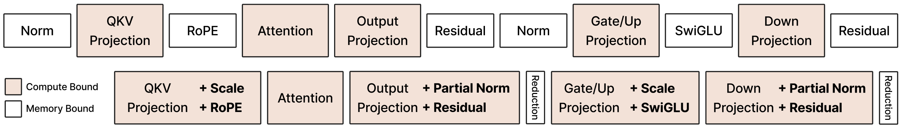

# CODA: GPU Kernels as GEMM-plus-Epilogue Programs

<p align="center">
  
</p>

<p align="center">
  <a href="https://arxiv.org/abs/2605.19269"></a>
</p>

**CODA** is a GPU kernel abstraction that expresses Transformer operators as GEMM-plus-epilogue programs, fusing normalization, activations, residual updates, and reductions into the GEMM output tile before it is written to global memory, combining framework-level productivity with hardware-level efficiency. CODA is built on [CUTLASS CuTeDSL](https://github.com/NVIDIA/cutlass) and targets NVIDIA Hopper (H100) GPUs.

<p align="center">
  
</p>


## Quick Start

> [!NOTE]
> We autotune each kernel the first time it sees a new input configuration (shape, dtype, etc.), so the initial call may take a while.

### Kernel level

Individual GEMM-plus-epilogue kernels are in `coda/kernels/gens/epilogue/`. The base pattern for `gemm_residual_rmsnorm_gemm` (no extra epilogue) uses two kernels in sequence:

```python
import torch
from coda.kernels.gens import gpt as gens
from coda.models.ops import compute_rstd

M, K, N = 4096, 4096, 4096
dtype = torch.bfloat16
device = "cuda"

# tile size for partial reductions; autotuned when used inside a full block
block_size = 128

y   = torch.randn(M, K, dtype=dtype, device=device)   # attention output
x   = torch.randn(M, N, dtype=dtype, device=device)   # residual
w_a = torch.randn(K, N, dtype=dtype, device=device)   # attention out-proj weight
w_b = torch.randn(N, N, dtype=dtype, device=device)   # MLP gate+up weight
w_n = torch.randn(N,    dtype=dtype, device=device)   # MLP RMSNorm weight

# Kernel 1: attention out-proj + residual add + partial RMS norm + norm weight scaling
#   D = y @ w_a + x             (M, N)           -- out-proj with residual add
#   S = partial mean(D**2)      (M, num_blocks)  -- partial RMS norm stats
#   O = D * w_n                 (M, N)           -- norm weight scaling
D, S, O = gens.gemm_residual_partial_rmsnorm(A=y, B=w_a, C=x, W=w_n, block_size=block_size)

# per-row rstd, shape (M,)
R = compute_rstd(s=S, eps=1e-6, use_quack=False)

# Kernel 2: RMS norm + MLP gate+up projection + SwiGLU
#   D = O @ w_b * R             (M, N)          -- normalized gate+up pre-activation
#   O = silu(gate) * up         (M, N // 2)     -- SwiGLU output
D, O = gens.gemm_rmsnorm_swiglu(A=O, B=w_b, R=R)
```

### Ops level

`coda/models/ops.py` provides high-level fused ops that cover full Transformer blocks (excluding attention). Each op represents a reparameterized Transformer layer, spanning from the attention output projection through the MLP to the QKV projection of the next layer.
```python
import torch
from coda.models import ops

# Forward pass through a Transformer block (excluding attention)
x_out, qkv = ops.layer(
    x0=x0,          # residual stream input
    y0=y0,          # attention output
    w0=w0,          # attention out-proj weight
    w1=w1,          # MLP gate+up weight
    w2=w2,          # MLP down weight (next block)
    w3=w3,          # QKV projection weight (next block)
    wn0=wn0,        # RMS norm weight (post-attention)
    wn1=wn1,        # RMS norm weight (pre-QKV)
    cos_sin=cos_sin,
    cos=cos,
    sin=sin,
    num_heads=num_heads,
    head_dim=head_dim,
    eps=1e-6,
    transpose=True,
    backend="coda",
    use_compile=True,
)
```

## Writing a New Epilogue

The CODA GEMM mainloop is fixed; an epilogue plugs into it by overriding a handful of callback methods on `EpilogueVisitorTree` (defined in [coda/core/epilogue/base.py](coda/core/epilogue/base.py)). The mainloop produces a GEMM accumulator tile `tRS_rAcc` in registers, walks it sub-tile by sub-tile, and invokes the epilogue at well-defined hook points before staging the result through shared memory and storing it out via TMA.

### Mainloop / epilogue interaction

```python
# once per output tile, after the GEMM mainloop produces tRS_rAcc
evt.consumer_begin(...)              # load per-tile inputs gmem -> smem
evt.producer_begin(...)              # set up TMA producer state (if any)

for sub_tile in epi_tiles:
    evt.consumer_begin_loop(...)     # load smem -> registers for this sub-tile
    evt.producer_tma_load(...)       # issue async TMA loads (if any)
    evt.consumer_visit(tRS_rD, ...)  # MUTATE the accumulator tile: the core op
    # mainloop: cast and stage tRS_rD into smem
    evt.consumer_smem_store(...)     # optional extra smem writes (e.g. partial reductions)
    # mainloop: TMA-store smem -> gmem
    evt.consumer_tma_store(...)      # optional post-store callback
    evt.consumer_end_loop(...)

evt.consumer_end(...)                # post-loop finalization
```

Per-tile and per-sub-tile state (smem views, register tensors) flows between these calls through return values that the mainloop threads forward as arguments.

### Methods

| Method | What it does |
|--------|--------------|
| `to_underlying_arguments` | Converts host-side `EpilogueArguments` into device-side `EpilogueParams` (adds alignment hints, etc.). Called before the kernel launch. |
| `get_smem_struct` / `get_smem_tensors` / `get_smem_bytes_per_stage` | Declare the shared memory buffers this epilogue needs (dtypes + sizes), build CuTe tensor views over them, and report per-stage byte budgets. |
| `consumer_begin` | Once per CTA output tile: load per-tile inputs (e.g. an `R` column vector for RMS norm) from global to shared memory and produce partitioned smem views. |
| `producer_begin` / `producer_tma_load` | Set up and drive the TMA producer pipeline for inputs loaded asynchronously per sub-tile (e.g. a residual matrix). No-ops by default. |
| `consumer_begin_loop` | Per epilogue sub-tile: copy the relevant slice of smem into registers, ready to be combined with the accumulator. |
| `consumer_visit` | **The core operation.** Mutates the accumulator register tile `tRS_rD` in place; this is where the actual elementwise / reduction math happens. Receives `tRS_rD` in accumulator dtype (typically fp32); the cast to output dtype happens afterwards in the mainloop. |
| `consumer_smem_store` | Optional extra writes to shared memory after `tRS_rD` has been staged into smem but before the TMA store (e.g. writing partial reduction results). |
| `consumer_tma_store` | Callback fired immediately after the mainloop TMA-stores the tile to global memory; useful for chaining additional global writes. |
| `consumer_end_loop` / `consumer_end` | Per sub-tile and per CTA-tile cleanup hooks. |

### Example: per-row scaling

`EVTRMSNormScale` in [coda/kernels/gens/epilogue/kernel_1.py](coda/kernels/gens/epilogue/kernel_1.py) multiplies the GEMM accumulator by a per-row scalar `R` (the RMS norm reciprocal std dev). The load-and-multiply core looks like:

```python
@cute.jit
def consumer_begin(self, ..., epi_params, epi_tensors_smem):
    sColVec = epi_tensors_smem.sColVec
    # take this CTA's slice of the global R vector, then async-copy gmem -> smem
    gColVec = cute.local_tile(epi_params.mColVec, (tile_M,), (m_idx,))
    memory_utils.g2s_copy_1d(src=gColVec, dst=sColVec, ...)
    # broadcast the column along N (stride 0), then partition across threads
    sColVec_view = cute.make_tensor(
        sColVec.iterator,
        cute.make_layout((tile_M, tile_N), stride=(1, 0)),
    )
    tDsColVec = partition_for_epilogue(sColVec_view)
    # wait for cp.async, then sync the consumer warps
    cute.arch.cp_async_commit_group()
    cute.arch.cp_async_wait_group(0)
    epi_barrier.arrive_and_wait()
    return self.EpilogueTensors(tDsColVec=tDsColVec)

@cute.jit
def consumer_begin_loop(self, ..., epi_coord, epi_tensors):
    # select this sub-tile's slice of the smem view, then copy smem -> registers (acc dtype)
    tDsColVec_cur = epi_tensors.tDsColVec[..., epi_coord]
    tDrColVec_cvt = memory_utils.s2r_copy_1d(tDsColVec_cur, dtype=self.acc_dtype)
    return self.EpilogueTensorsLoop(tDrColVec_epi=tDrColVec_cvt), ...

@cute.jit
def consumer_visit(self, tRS_rD, ..., epi_tensors_loop):
    # per-row scaling: multiply each accumulator element by the matching R value
    tDrColVec_epi = epi_tensors_loop.tDrColVec_epi
    for i in cutlass.range_constexpr(cute.size(tDrColVec_epi)):
        tRS_rD[i] = tRS_rD[i] * tDrColVec_epi[i]
    return epi_tensors_loop
```

## Repository Structure

```
coda-kernels/
├── pyproject.toml
└── coda/
    ├── models/          # High-level API
    │   ├── ops.py       # CODA layer implementations (forward + backward)
    │   └── ops2.py      # Corresponding PyTorch implementations
    ├── kernels/
    │   ├── gens/        # LLM-authored CuTeDSL kernel implementations
    │   ├── refs/        # PyTorch reference implementations
    │   ├── tests/
    │   └── benchmarks/
    └── core/            # CODA kernel infrastructure (formerly "rapier")
        ├── gemm/        # WGMMA GEMM kernels and PyTorch wrapper
        ├── epilogue/    # Composable epilogue visitors
        ├── ops/         # Low-level utilities
        ├── examples/    # Standalone usage examples
        └── docs/        # Docs for LLM
```

### Epilogue Visitors (`coda/core/epilogue/`)

| Module | Description |
|--------|-------------|
| `bias` | Row/column bias addition |
| `reduction` | Block-level row/column reductions (store, store-2X, load variants) |
| `activation` | Dual-output activations: elementwise, pairwise, contraction, expansion |
| `matrix` | TMA-pipelined matrix load with residual add; 2X paired-tile variant |
| `cross_entropy` | Online softmax + target logit selection, fused into the output tile |
| `composite` | Chains multiple visitors into a single unified epilogue |
